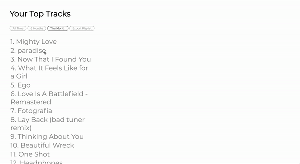

# Spotifier 

Spotifier is a React-Redux web application that aims to give users insights into their musical habits. Spotifier queries Spotify's API to retrieve your 50 top listened tracks and artists, and subsequently offers insights into the traits of each individual track. Playlists are offered over three time periods, all of which are dated from today: 1 month, 6 months, and All Time. These playlists can be downloaded via the Export Playlist button. Artists can be toggled, as an easter egg (aka in development), by clicking on 'Top Tracks'. 

# How to build/run Spotifier 

1. Clone the repo 
2. `npm install`
3. `make start` 

That's it! Access will require you login to your Spotify account; otherwise, the only other "requirement" is that as result of this being in development, it is currently built as a fullscreen, Desktop experience. 

# Software Links  
* [Playlist Export](https://developer.spotify.com/documentation/web-api/reference/playlists/create-playlist/)
* [Audio Features](https://developer.spotify.com/documentation/web-api/reference/tracks/get-audio-features/)